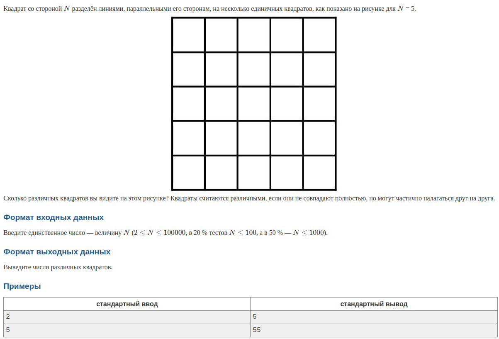

### Сложные , алгоритмы
+ https://codeforces.com/problemset/problem/230/B


### Легкие , но нужно догадаться

+ https://codeforces.com/contest/1374/problem/C
+ https://codeforces.com/problemset/problem/1433/A
+ https://codeforces.com/problemset/problem/1703/A


### Жадные алгоритмы 
+ https://codeforces.com/problemset/problem/1367/B   (легкая)
+ https://codeforces.com/problemset/problem/1353/B ( посложнее)


def euclidus(numerator, denominator):
  if numerator == denominator:
    return(numerator)
  else:
    if numerator > denominator:
      return euclidus(numerator - denominator, denominator)
    else:
      return euclidus(numerator, denominator - numerator)

print(euclidus(9,6))

## Просто интересные 
https://codeforces.com/problemset/problem/731/A - I like that one
https://codeforces.com/contest/1594/problem/B  - trikky
https://codeforces.com/group/n0DBH6xFai/contest/474940/problem/F - simple, just ot know how to solve 
https://codeforces.com/problemset/problem/702/C - two pointers, should solve by your self 

https://codeforces.com/problemset/problem/279/B - an example on how to solve task with two pointers
https://codeforces.com/problemset/problem/1006/C - two pointers and interesting problem
https://codeforces.com/problemset/problem/1073/C - reallly hard, two pointers try to solve, use manhetonskoe rastoyanie

## текстовые задачи
### квадраты с irunner
#### условие :

#### решение 
в массив запишем все квадраты числе от 1 до n
мы можем заметить что для квадатов с одинаковой стороной их количество будет равно
значиению в перевернутом массиве 
Трудно обьяснитьт , лучше показать
например N = 5
тогда массив s = [1,4,9,16,25]
перевернутый массив = [25,16,9,4,1]
отсюда видно , что квадратов со стороной 1 будет 25 , а квадратов 
со стороной 5 будет всего 1 (самый большой) что логично
отсюдова кол-во всех квадратов равно сумме элеменов в массиве :)))

#### КОД


```python
n = int(input())
res = 0

for i in range(1,n+1):
    res += i**2
print(res)

```


